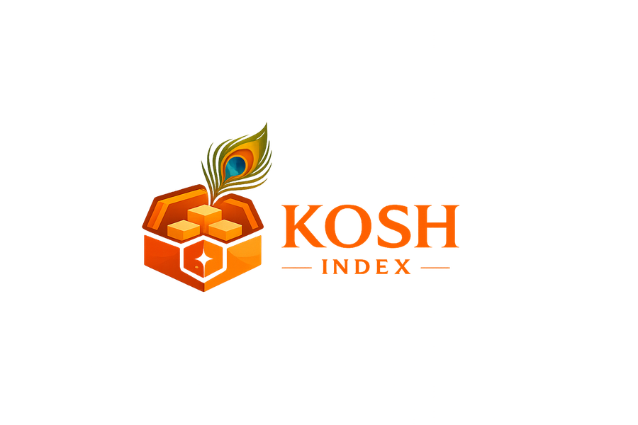

# Kosh — vāṇī Package Registry



**Kosh** (कोश, *storehouse*) is the official package registry for the
[vāṇī compiler](https://github.com/enthusiasticgeek/vani-compiler).

It lets you share and reuse vāṇī libraries — from numerical calculus to
probability distributions — with a single line in your `vani.toml` and one
command to fetch them.

```
vanic add calculus
```

---

## What this site is

| Audience | Go to |
|---|---|
| I want to **use** a package in my project | [Adding a Dependency](using-kosh/README.md) |
| I want to **publish** my library | [Publishing Overview](publishing/README.md) |
| I'm building a **kosh-compatible tool** | [Registry Protocol](protocol.md) |
| I want to know who controls what | [Governance](governance.md) |

---

## Registry endpoint

```
https://enthusiasticgeek.github.io/kosh-index
```

This URL is the value of `registry = "kosh"` in your `vani.toml`.
The compiler resolves it to fetch `config.json` and `index/<name>.json`
automatically — you never need to type the URL yourself.

---

## Available packages

15 packages are published today, spanning linear algebra
(`matrix`, `sparse`, `tensor`), calculus (`calculus`, `vectorcalc`,
`pde`), algebra (`algebra`, `interval`, `complex`), applied math
(`probability`, `optimize`, `geometry`, `signal`, `discrete`), and a
minimal example template (`hello-kosh`).

Browse the full [Package Catalog](catalog.md) for versions,
dependencies, and checksums -- that page is the source of truth;
this list intentionally isn't duplicated here so it can't drift out
of sync the way it previously did.
